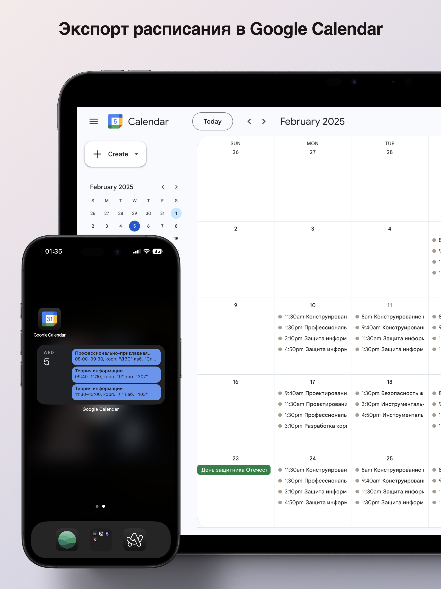

<div align="center">

<h1>SibSAU Schedule Bot</h1>
</div>

A Telegram bot for accessing and tracking class schedules at Siberian State University of Science and Technology. Get instant access to both student group and professor schedules, with real-time updates, notifications for changes, and AI-powered schedule analysis.

<div align="center" style="display: flex; justify-content: space-between;">
  
  
</div>
<div align="center" style="display: flex; justify-content: space-between;">
  
  
</div>

## Features

- Group and professor schedule search  
- Day/week navigation  
- Change notifications  
- Support for regular classes, exams, and consultations  
- Google Calendar export  
- Basic AI-powered schedule analysis 

## Installation & Development Setup 🛠️

1. Clone the repository:

```bash
git clone https://github.com/mordvn/pallada_tgbot.git
cd pallada_tgbot
```

2. Create and activate virtual environment &
3. Install dependencies:

```bash
uv sync
```

4. Configure .env with your configuration:

```bash
TG_BOT_TOKEN=your_bot_token
```

5. Run the bot:

```bash
uv run python3 app/main.py
```

## Deployment 

```bash
```
docker build -t pallada_tgbot .
docker run --env-file .env pallada_tgbot
```
```

## Usage

1. Start the bot
2. Enter a group name or professor's surname
3. Navigate through the schedule using the inline keyboard
4. Enable notifications to stay updated about schedule changes
5. Use the AI analysis button (📊) to get smart insights about your schedule

### Google Calendar Export

1. Open your schedule in the bot
2. Click the "Export to Calendar" button
3. Follow the link to add events to your Google Calendar
* Your schedule will be synced with Google Calendar, including:
   - Class times and locations
   - Professor names and subjects
   - Automatic updates when schedule changes

## Contributing

Contributions are welcome! Here's how you can help:

1. Fork the repository
2. Create your feature branch (`git checkout -b feature/myfeature`)
3. Commit your changes (`git commit -m 'addfeature'`)
4. Push to the branch (`git push origin feature/amazingfeature`)
5. Open a Pull Request

## License

MIT

---
Made with ❤️ for SibSAU students and professors
