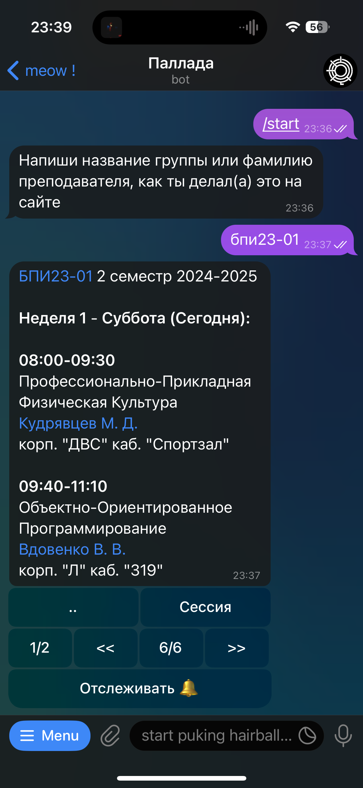
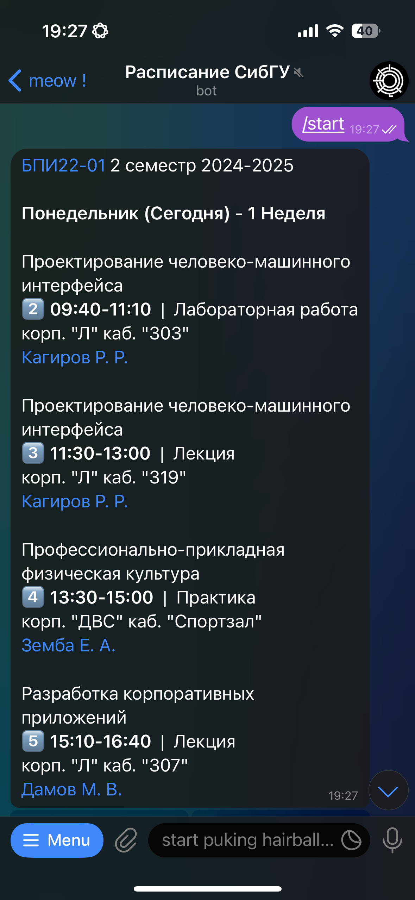

# SibSAU Schedule Bot 🤖

A Telegram bot for accessing and tracking class schedules at Siberian State University of Science and Technology. Get instant access to both student group and professor schedules, with real-time updates and notifications for any changes.

<div align="center">
  
  
</div>

## Features ✨

- 🔍 Quick search for both student groups and professors
- 📅 View schedules by week and day
- 🔄 Real-time schedule updates˘¿
- 🔔 Notifications for schedule changes
- 📱 User-friendly interface
- 🔗 Quick navigation between related schedules
- 📊 Support for regular classes, exam sessions, and consultations

## Installation & Development Setup 🛠️

1. Clone the repository:

```bash
git clone https://github.com/unknown81d/pallada_tgbot.git
cd pallada_tgbot
```

2. Create and activate virtual environment &
3. Install dependencies:

```bash
poetry install
```

4. Configure .env with your configuration:

```bash
TG_BOT_TOKEN=your_bot_token
```

5. Run the bot:

```bash
poetry run python src/__init__.py
```

## Usage 📱

1. Start the bot: Search for `@pallada_sibsau_bot` on Telegram or click [here](https://t.me/pallada_sibsau_bot)
2. Enter a group name or professor's surname
3. Navigate through the schedule using the inline keyboard
4. Enable notifications to stay updated about schedule changes

## Contributing 🤝

Contributions are welcome! Here's how you can help:

1. Fork the repository
2. Create your feature branch (`git checkout -b feature/AmazingFeature`)
3. Commit your changes (`git commit -m 'Add some AmazingFeature'`)
4. Push to the branch (`git push origin feature/AmazingFeature`)
5. Open a Pull Request

## Acknowledgments 🙏

- Thanks to SibSAU for providing schedule data
- All contributors who have helped improve this bot
- The Python Telegram Bot community for their excellent documentation and support

## Support the Project ❤️

If you find this bot useful, please consider:
- Starring the repository ⭐
- Sharing it with others 🔄
- Contributing to its development 💻
- Supporting through donations 💖

---
Made with ❤️ for SibSAU students and professors
